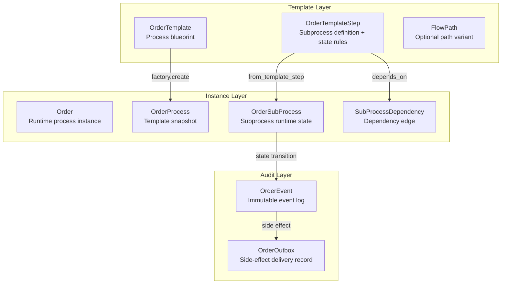

# Core Concepts

## Three-Layer Architecture



When an order is created, the template is snapshotted into `OrderProcess`; the template can then evolve independently.

## Template Layer

### OrderTemplate

Process blueprint. Contains `name`, `version`, `status` (draft/published/deprecated/archived).

- `ordered_steps(steps)`: sort by `step_order`
- `steps_before(steps, start_from)`: return step names before the entry point (used for `start_from` skipping)
- `snapshot(steps)`: produce an immutable snapshot stored in `OrderProcess.template_snapshot`

Templates should evolve through new versions after publication; in-place modification is discouraged.

### OrderTemplateStep

Subprocess definition. The core is the state classification:

```python
terminal_states = ["locked", "failed"]   # all possible terminal states
advance_states  = ["locked"]              # states that advance downstream (subset of terminal)
rollback_states = ["failed"]              # states that can trigger rollback (subset of terminal)
```

Other fields:
- `handler_class`: string resolved by `HandlerRegistry` to a handler instance
- `depends_on`: list of upstream step names (forming DAG edges)
- `timeout_seconds` / `timeout_status`: timeout configuration
- `on_start_notify` / `on_complete_notify` / `on_rollback_notify` / `on_timeout_notify`: notification config

### FlowPath

Optional path variant. Declares `start_from` (entry step) and `skip_steps` (steps to skip),
used for alternative execution paths within the same template (e.g. a fast track skipping review).

## Instance Layer

### Order

Runtime process instance. Carries `context` (business context) and `status` (pending/running/completed/rolled_back/suspended).

- `mark_completed()`: called automatically by the dispatcher when all non-skipped subprocesses reach advance states

### OrderProcess

Template snapshot bound to an Order. `template_snapshot` stores the template structure at creation time,
ensuring running instances are unaffected by later template modifications.

### OrderSubProcess

Runtime state for a single subprocess. Key fields:

- `status`: current state (pending → running → terminal)
- `started_at` / `completed_at` / `timeout_at`: lifecycle timestamps
- `skipped`: whether this subprocess was skipped (skipped subprocesses reject events)
- `source`: `template` (from template) or `dynamic` (appended at runtime)
- `is_reversible`: whether rollback is allowed
- `rollback_status`: rollback state machine (not_required → running → completed/failed)
- `version`: optimistic lock version (`OptimisticLockMixin`)

State inspection methods:
- `is_terminal(status)`: is the status terminal?
- `is_advance_status(status)`: does the status advance the process?
- `can_receive_event()`: skipped subprocesses return False
- `can_rollback()`: reversible + not already rolled back + currently in a rollback state
- `dependency_satisfied()`: skipped or advanced → satisfies downstream dependencies

### SubProcessDependency

Dependency edge between subprocesses. `subprocess_id` → `depends_on_id` means "the former depends on the latter".

- `group_by_subprocess(dependencies)`: group edges by downstream subprocess ID (used by the dispatcher to check readiness)

The factory automatically expands transitive dependencies: if A depends on B and B is skipped, A's dependency is transitively rewired to B's upstream.

## Audit & Side-Effect Layer

### OrderEvent

Immutable event log. Every state transition produces one event, supporting:

- **Audit**: `event_type` / `from_status` / `to_status` / `payload`
- **Idempotency**: `event_key` uniquely identifies an operation; duplicate submissions return `duplicate=True`
- **Causality**: `correlation_id` (same transaction) / `causation_id` (causal relationship)

Event type constants: `stateflow:event:order_created` / `stateflow:event:sp_created` / `stateflow:event:sp_skipped` / `stateflow:event:sp_status_changed` / `stateflow:event:sp_rollback_started` / `stateflow:event:sp_rollback_completed` / `stateflow:event:sp_rollback_failed` / `stateflow:event:order_completed` / `stateflow:event:sp_timeout` / `stateflow:event:conflict` (all framework tags are namespaced — see `.claude/rules/namespacing.md`)

### OrderOutbox

Side-effect delivery record. Decouples state transitions from external calls:

- `topic`: delivery target (`stateflow:topic:handler_start` / `stateflow:topic:handler_rollback` / `stateflow:topic:notification` / `stateflow:topic:timer`)
- `status`: pending → processing → sent / failed / cancelled
- `retry_count` / `next_retry_at`: retry control
- `payload`: delivery data (e.g. `{"subprocess_id": "..."}`)

Delivery is handled by a standalone `OrderOutboxDeliverer`, not executed inline during state transitions.

## Sync/Async Model Siblings

Every model has sync and async sibling classes mapping to the same table but inheriting from different base classes:

| Sync | Async | Base Class |
|------|-------|-----------|
| `Order` | `AsyncOrder` | `ActiveRecord` / `AsyncActiveRecord` |
| `OrderSubProcess` | `AsyncOrderSubProcess` | same + `OptimisticLockMixin` |
| `OrderEvent` | `AsyncOrderEvent` | same |
| ... | ... | ... |

Both share identical field declarations, business-logic methods, and factory methods. The only difference is DB operation semantics: sync `save()` is blocking; async `save()` is a coroutine.
