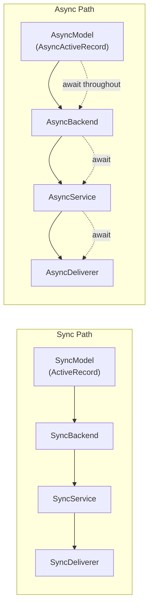

# Introduction

`rhosocial-stateflow` is a state transition and event-driven DAG orchestration framework built on `rhosocial-activerecord`.

## Design Goals

The framework uses "order flow" as an intuitive metaphor, but its core capabilities apply to any finite-state machine and directed acyclic workflow:

- Approval flows (submit → review → publish / reject)
- Ticket systems (create → assign → parallel processing → close)
- Task orchestration (DAG dependency advancement + timeout/rollback)
- Agent execution plans (step orchestration + failure compensation)
- Text-to-image/video generation (collect params → freeze credits → generate → deliver / refund)
- Fixed-seat booking (select seat → validate → pay → issue ticket)

## Core Capabilities

| Capability | Description |
|------------|-------------|
| Finite state machine | Each subprocess has `terminal_states` / `advance_states` / `rollback_states` |
| Event-driven DAG | `depends_on` forms a DAG; upstream advance auto-starts downstream |
| Immutable event log | Every transition is an `OrderEvent`; supports audit, idempotency (`event_key`), causality |
| Outbox pattern | Side effects (handler calls, notifications) written to `OrderOutbox`, delivered asynchronously |
| Optimistic concurrency | `OrderSubProcess` uses `OptimisticLockMixin`; conflicts become `ConcurrentStateTransitionError` |
| Rollback lifecycle | Reversible subprocesses: `begin_rollback → handler.rollback() → complete/fail_rollback` |
| Timeout scheduling | `mark_running` computes `timeout_at`; sweeper triggers `timeout_status` on expiry |

## Sync/Async Parity — Symmetric but Non-Interoperable

Every layer has fully parallel sync and async implementations:



**Both paths are self-contained. No layer may cross over.**

- Sync models (`Order`) have blocking `save()` / `query()`
- Async models (`AsyncOrder`) have coroutine `save()` / `query()` requiring `await`
- **Prohibited**: `asyncio.to_thread` bridging (blocks event loop, thread-safety issues)
- **Prohibited**: importing sync model classes in async code

See `.claude/rules/sync-async-non-interoperability.md` for details.

## Module Structure

```
src/rhosocial/stateflow/
├── types.py            # Status/event/outbox constants + dataclasses
├── exceptions.py       # StateflowError hierarchy
├── validators.py       # OrderTemplateValidator (DAG/state-set/timeout/FlowPath)
├── dispatcher.py       # _DispatcherBase + SyncOrderDispatcher + AsyncOrderDispatcher
├── factory.py          # _FactoryBase + SyncOrderFactory + AsyncOrderFactory
├── service.py          # SyncOrderService + AsyncOrderService (transactional)
├── deliverer.py        # SyncOrderOutboxDeliverer + AsyncOrderOutboxDeliverer
├── timer.py            # SyncTimeoutScheduler + AsyncTimeoutScheduler
├── registry.py         # HandlerRegistry + Sync/AsyncHandlerStart/RollbackTopic
├── handlers.py         # SyncSubProcessHandler / AsyncSubProcessHandler ABC
├── schema.py           # SQLite DDL + create_tables / async_create_tables
├── outbox.py           # Outbox constant re-export
├── models/             # 9 models × 2 (Sync + Async) = 18 classes
└── applications/        # Pre-built production components (sync/async parity)
    ├── approval_flow.py      # Content approval flow
    ├── ticket_system.py      # Ticket system (parallel DAG)
    ├── task_orchestration.py # Task pipeline (diamond DAG + timeout/rollback)
    ├── agent_plan.py         # Agent execution plan (failure compensation)
    ├── media_generation.py   # Text-to-image/video (credit freeze/refund)
    ├── seat_booking.py        # Fixed-seat booking (payment/ticketing)
    └── external_services.py   # Payment/credit protocols + mock implementations
```

> The directory tree is kept as a code block — it is not a flowchart; Mermaid is not suited for filesystem hierarchies.
