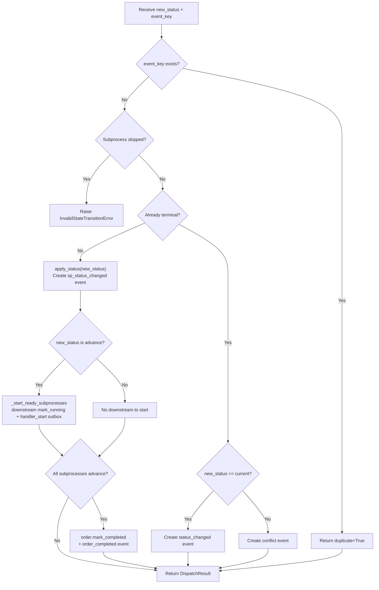
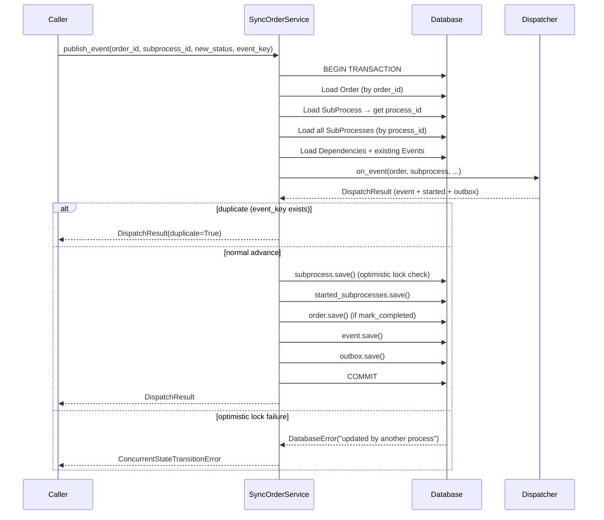
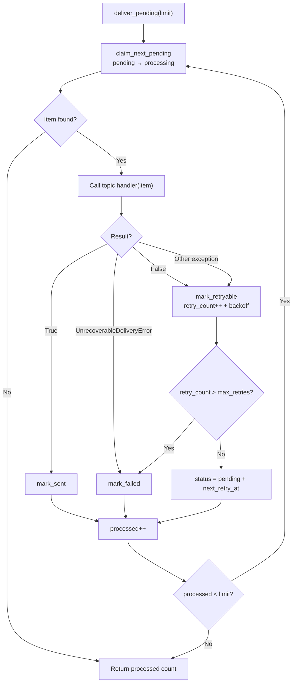
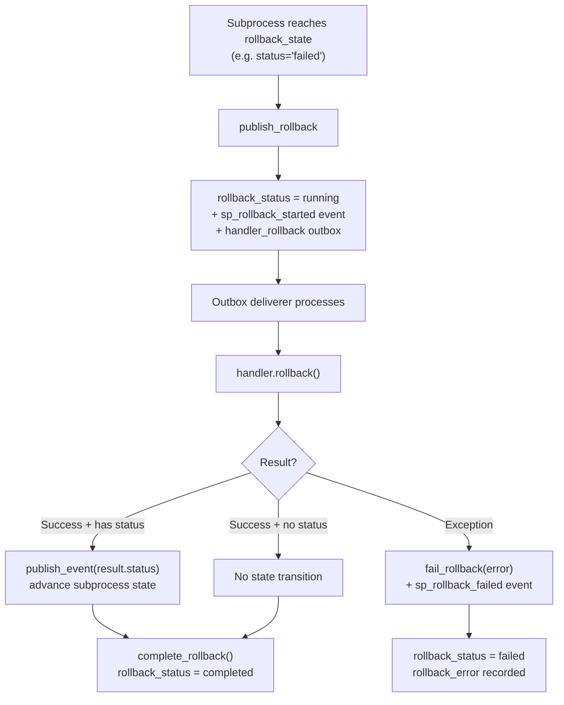

# Runtime

## Dispatcher

`SyncOrderDispatcher` / `AsyncOrderDispatcher` are **stateless** pure-logic components: they take in-memory objects, produce state changes + events + outbox items, and perform no I/O.

### Core Methods

#### `on_event`

Handles a subprocess status transition:



#### `on_timeout`

Wraps `on_event` using the subprocess's `timeout_status` as the target state.

#### `on_rollback`

Begins a reversible subprocess's rollback:

1. **Idempotency check**: same as `on_event`
2. **Eligibility check**: `can_rollback()` fails → `InvalidStateTransitionError`
3. `begin_rollback()` → create `sp_rollback_started` event + `handler_rollback` outbox

The actual handler call is performed asynchronously by the outbox deliverer.

### DispatchResult

```python
class DispatchResult:
    event: OrderEvent              # produced event
    started_subprocesses: list     # downstream subprocesses started
    outbox_items: list             # outbox items to deliver
    duplicate: bool                # whether this was a duplicate event
```

### Sync/Async Implementation

Dispatch logic is shared via `_DispatcherBase`; subclasses only override `_event_cls` / `_outbox_cls`:

- `SyncOrderDispatcher` → produces `OrderEvent` / `OrderOutbox`
- `AsyncOrderDispatcher` → produces `AsyncOrderEvent` / `AsyncOrderOutbox`

The `async def` methods on `AsyncOrderDispatcher` exist for API parity. `on_timeout` is overridden to `await self.on_event()` (the base `self.on_event()` returns a coroutine in the async path).

## Service Layer

`SyncOrderService` / `AsyncOrderService` perform **load → dispatch → persist** in a single transaction:

### publish_event



**Concurrency**: `OrderSubProcess` carries `OptimisticLockMixin`; UPDATE checks `version`.
If the version no longer matches (`affected_rows == 0`), `save()` raises `DatabaseError`,
which the service converts to `ConcurrentStateTransitionError`.

**Idempotency**: `event_key` is checked against loaded existing events; a match returns `duplicate=True` without writing anything.

### publish_timeout

Same structure as `publish_event`, but calls `dispatcher.on_timeout()`.

### publish_rollback

Same structure, but calls `dispatcher.on_rollback()`, producing a `sp_rollback_started` event + `handler_rollback` outbox.

## Outbox Deliverer

`SyncOrderOutboxDeliverer` / `AsyncOrderOutboxDeliverer` independently scan pending outbox items and deliver them.

### Delivery Loop



### Topic Registration

```python
deliverer.register_topic_handler("handler_start", topic_callable)
```

A topic handler is a callable returning `bool` (async path returns `Awaitable[bool]`).

### Recovery

`recover_stuck(stuck_after)`: resets `processing` items older than `stuck_after` back to `pending`,
for crash recovery. Does not increment `retry_count`.

## Handler Registry

### HandlerRegistry

```python
registry = HandlerRegistry(allow_dynamic_import=False)
registry.register("app.handlers.PaymentHandler", PaymentHandler)
```

- Explicit registration takes priority
- With `allow_dynamic_import=True`, `"module.attr"` keys are resolved via `importlib.import_module`
- `instantiate(key, subprocess)` returns a `SyncSubProcessHandler` instance
- `instantiate_async(key, subprocess)` returns an `AsyncSubProcessHandler` instance

### Standard Topic Implementations

#### SyncHandlerStartTopic / AsyncHandlerStartTopic

Standard implementation of the `handler_start` topic:

1. Extract `subprocess_id` from outbox payload → load subprocess + order_id
2. `registry.instantiate(handler_class, subprocess)` → handler instance
3. `handler.start()` → `HandlerResult`
4. If result has status → `service.publish_event()` to advance state
5. Return `True` (deliverer marks sent)

Unregistered handler_class → `UnknownHandlerError` → `UnrecoverableDeliveryError` (non-retryable)

#### SyncHandlerRollbackTopic / AsyncHandlerRollbackTopic

Standard implementation of the `handler_rollback` topic:

1. Load subprocess + handler
2. `handler.rollback()` → `HandlerResult`
3. If result has status → `service.publish_event()` to advance state
4. `subprocess.complete_rollback()` + save
5. On exception → `fail_rollback(error)` + create `sp_rollback_failed` event

## Rollback Lifecycle



`can_rollback()` requires: `is_reversible=True` + `rollback_status=not_required` + current status is in `rollback_states`.

Idempotent: repeating `publish_rollback` with the same `event_key` → `duplicate=True`.

## Timeout Scheduling

### timeout_at Computation

`OrderSubProcess.mark_running()` sets `started_at` and, when `timeout_seconds` is not None, computes:
`timeout_at = started_at + timedelta(seconds=timeout_seconds)`.

### Sweeper

`SyncTimeoutScheduler` / `AsyncTimeoutScheduler`:

```python
scheduler = SyncTimeoutScheduler(service)
processed = scheduler.tick()  # scan due subprocesses → service.publish_timeout
```

- Query: `skipped == False AND timeout_at <= now`
- Each subprocess handled in its own transaction; a single failure doesn't affect others
- `limit` parameter caps the number of items per sweep
