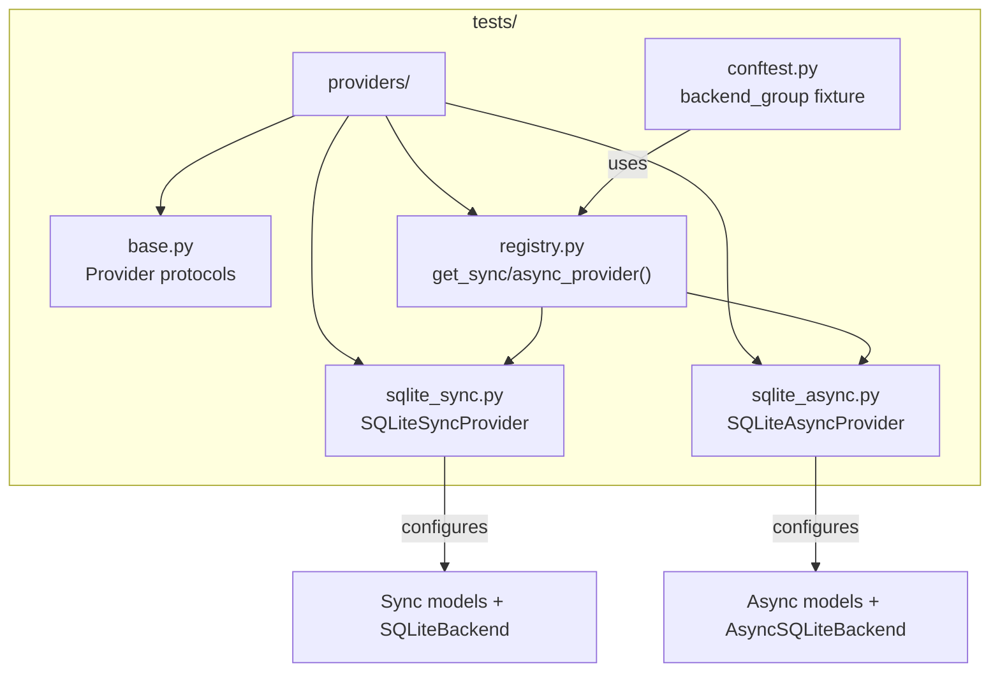

# Testing

## Running Tests

```bash
cd python-stateflow
pytest
```

Current 120 tests cover:

| Category | Count | Coverage |
|----------|-------|----------|
| Template validation | 6 | DAG cycle detection, state-set constraints, timeout status, FlowPath references |
| Factory | 4 | Dependency propagation, skip_steps, start_from, dynamic append |
| Dispatcher | 4 | Idempotency, downstream start, terminal conflict, skipped rejection |
| Service layer | 10 | State advance + persistence, downstream start + outbox, idempotency, order completion, conflict events, skipped rejection, concurrency error, timeout |
| Outbox deliverer | 10 | Success/retry/failure/unrecoverable/unknown topic/limit/recovery/not-yet-due |
| Handler registry | 8 | Explicit registration/dynamic import/unknown handler + handler_start topic |
| Rollback lifecycle | 8 | Eligibility/start/complete/fail record/idempotency/double rollback rejection |
| Timeout scheduling | 5 | timeout_at computation/due trigger/not-due skip/limit |
| Async path | 8 | AsyncSQLiteBackend full chain: service/deliverer/timer/registry/rollback |
| Sync/async parity | 3 | Method-name parity + coroutine checks |
| Models + queries | 39 | 9 models CRUD + Query helper construction |
| Application components | 23 | 7 pre-built components (ApprovalFlow/TicketSystem/TaskOrchestration/AgentPlan/MediaGenerationFlow/SeatBookingFlow) sync+async full chain |

## Multi-Backend Provider Architecture



### How It Works

1. `conftest.py` adds `tests/` to `sys.path` so `providers` is importable
2. `backend_group` fixture calls `sync_provider.setup()` → configures models + creates schema
3. Tests use the `backend_group` fixture to get a configured backend
4. On teardown, `sync_provider.teardown()` cleans up

### Adding a New Backend

Example: MySQL sync provider

```python
# tests/providers/mysql_sync.py
from .base import StateflowSyncProvider

class MySQLSyncProvider(StateflowSyncProvider):
    @property
    def name(self):
        return "mysql-sync"

    @property
    def models(self):
        return (OrderTemplate, OrderTemplateStep, ...)  # sync models

    def setup(self):
        config = MySQLConnectionConfig(host="localhost", ...)
        group = BackendGroup(name="stateflow-mysql", models=list(self.models),
                             config=config, backend_class=MySQLBackend)
        group.configure()
        backend = group.get_backend()
        backend.connect()
        backend.introspect_and_adapt()
        create_tables(backend)  # requires backend-specific DDL
        return group

    def teardown(self, handle):
        drop_tables(handle.get_backend())
        handle.disconnect()
```

```python
# tests/providers/registry.py — register the new provider
from .mysql_sync import MySQLSyncProvider

def get_sync_providers():
    return [SQLiteSyncProvider(), MySQLSyncProvider()]
```

### Test Commands

```bash
# Sync tests only
pytest -k "not async"

# Async tests only
pytest tests/rhosocial/stateflow_test/feature/test_async_path.py
```
