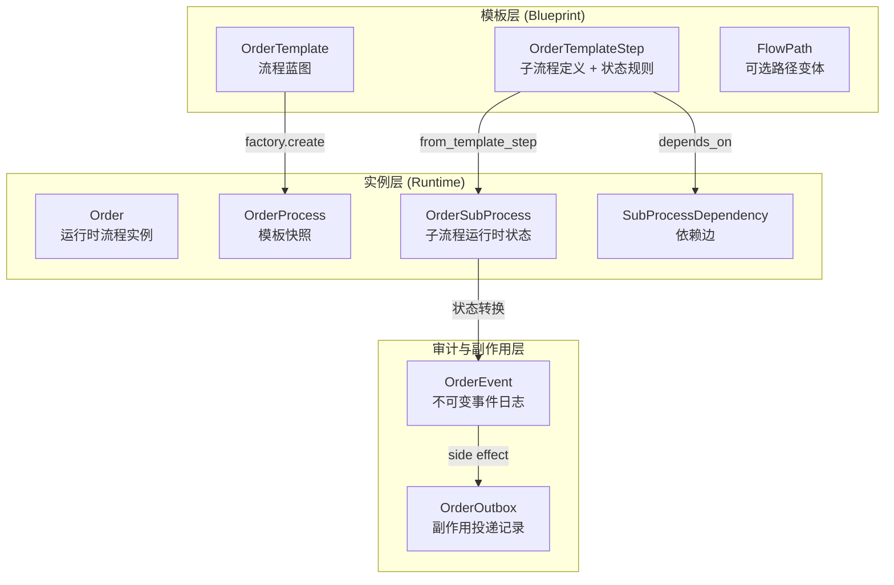

# 核心概念

## 三层架构



每次创建订单时，模板被快照到 `OrderProcess`，之后模板可独立演进。

## 模板层

### OrderTemplate

流程蓝图。包含 `name`、`version`、`status`（draft/published/deprecated/archived）。

- `ordered_steps(steps)`：按 `step_order` 排序
- `steps_before(steps, start_from)`：返回入口点之前的步骤（用于 `start_from` 跳过）
- `snapshot(steps)`：生成不可变快照，存入 `OrderProcess.template_snapshot`

模板发布后应通过新版本演进，不应原地修改。

### OrderTemplateStep

子流程定义。核心是状态分类规则：

```python
terminal_states = ["locked", "failed"]   # 子流程所有可能终态
advance_states  = ["locked"]              # 推进下游的终态（terminal 子集）
rollback_states = ["failed"]              # 可触发回滚的终态（terminal 子集）
```

其他字段：
- `handler_class`：字符串，由 `HandlerRegistry` 解析为 handler 实例
- `depends_on`：上游步骤名列表（构成 DAG 边）
- `timeout_seconds` / `timeout_status`：超时配置
- `on_start_notify` / `on_complete_notify` / `on_rollback_notify` / `on_timeout_notify`：通知配置

### FlowPath

可选路径变体。声明 `start_from`（入口步骤）和 `skip_steps`（跳过的步骤），
用于同一模板的不同执行路径（如快速通道跳过审核）。

## 实例层

### Order

运行时流程实例。携带 `context`（业务上下文）和 `status`（pending/running/completed/rolled_back/suspended）。

- `mark_completed()`：当所有非跳过子流程到达 advance 状态时，由调度器自动调用

### OrderProcess

模板快照绑定到 Order。`template_snapshot` 存储创建时的模板结构，
确保运行中的实例不受模板后续修改影响。

### OrderSubProcess

单个子流程的运行时状态。关键字段：

- `status`：当前状态（pending → running → 终态）
- `started_at` / `completed_at` / `timeout_at`：生命周期时间戳
- `skipped`：是否被跳过（跳过的子流程不接收事件）
- `source`：`template`（来自模板）或 `dynamic`（运行时追加）
- `is_reversible`：是否可回滚
- `rollback_status`：回滚状态机（not_required → running → completed/failed）
- `version`：乐观锁版本号（`OptimisticLockMixin`）

状态判断方法：
- `is_terminal(status)`：是否终态
- `is_advance_status(status)`：是否推进状态
- `can_receive_event()`：跳过的子流程返回 False
- `can_rollback()`：可逆 + 未回滚过 + 当前在 rollback_state
- `dependency_satisfied()`：跳过或已 advance → 满足下游依赖

### SubProcessDependency

子流程间的依赖边。`subprocess_id` → `depends_on_id` 表示"前者依赖后者"。

- `group_by_subprocess(dependencies)`：按下游子流程 ID 分组（用于调度器判断就绪状态）

工厂创建时会自动展开传递依赖：如果 A 依赖 B，B 被跳过，则 A 的依赖会传递到 B 的上游。

## 审计与副作用层

### OrderEvent

不可变事件日志。每次状态转换产生一条，支持：

- **审计**：`event_type` / `from_status` / `to_status` / `payload`
- **幂等**：`event_key` 唯一标识一次操作，重复提交返回 `duplicate=True`
- **因果链**：`correlation_id`（同一事务） / `causation_id`（因果关系）

事件类型常量：`stateflow:event:order_created` / `stateflow:event:sp_created` / `stateflow:event:sp_skipped` / `stateflow:event:sp_status_changed` / `stateflow:event:sp_rollback_started` / `stateflow:event:sp_rollback_completed` / `stateflow:event:sp_rollback_failed` / `stateflow:event:order_completed` / `stateflow:event:sp_timeout` / `stateflow:event:conflict`（框架标签全部命名空间化，见 `.claude/rules/namespacing.md`）

### OrderOutbox

副作用投递记录。将状态转换与外部调用解耦：

- `topic`：投递目标（`stateflow:topic:handler_start` / `stateflow:topic:handler_rollback` / `stateflow:topic:notification` / `stateflow:topic:timer`）
- `status`：pending → processing → sent / failed / cancelled
- `retry_count` / `next_retry_at`：重试控制
- `payload`：投递数据（如 `{"subprocess_id": "..."}`）

投递由独立的 `OrderOutboxDeliverer` 处理，不在状态转换事务中直接执行。

## 同步/异步模型兄弟

每个模型都有同步和异步两个兄弟类，映射到同一张表但继承不同基类：

| 同步 | 异步 | 基类 |
|------|------|------|
| `Order` | `AsyncOrder` | `ActiveRecord` / `AsyncActiveRecord` |
| `OrderSubProcess` | `AsyncOrderSubProcess` | 同上 + `OptimisticLockMixin` |
| `OrderEvent` | `AsyncOrderEvent` | 同上 |
| ... | ... | ... |

两套类共享相同的字段声明、业务逻辑方法和工厂方法。区别仅在 DB 操作语义：
同步的 `save()` 是阻塞调用，异步的 `save()` 是协程。
