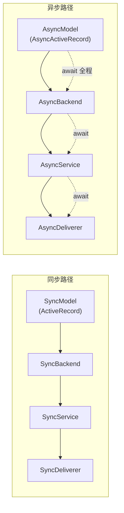

# 简介

`rhosocial-stateflow` 是基于 `rhosocial-activerecord` 的通用状态流转与事件驱动 DAG 编排框架。

## 设计目标

框架以"订单流程"为直觉隐喻，但核心能力面向任意有限状态机与有向无环流程：

- 审批流（提交 → 审核 → 发布 / 驳回）
- 工单系统（创建 → 分配 → 并行处理 → 关闭）
- 任务编排（DAG 依赖推进 + 超时/回滚）
- Agent 执行计划（步骤编排 + 失败补偿）
- 文生图/文生视频（参数收集 → 积分预扣 → 生成 → 结果回收 → 交付 / 退款）
- 固定座位订票（选座 → 校验 → 支付 → 出票）

## 核心能力

| 能力 | 说明 |
|------|------|
| 有限状态机 | 每个子流程有 `terminal_states` / `advance_states` / `rollback_states` 三类终态 |
| 事件驱动 DAG | 子流程间的 `depends_on` 构成有向无环图，上游 advance 后自动启动下游 |
| 不可变事件日志 | 每次状态转换记录为 `OrderEvent`，支持审计、幂等（`event_key`）、因果链 |
| Outbox 模式 | 副作用（handler 调用、通知）写入 `OrderOutbox`，由独立投递器异步处理 |
| 乐观并发控制 | `OrderSubProcess` 使用 `OptimisticLockMixin`，冲突转为 `ConcurrentStateTransitionError` |
| 回滚链路 | 可逆子流程的 `begin_rollback → handler.rollback() → complete/fail_rollback` 全生命周期 |
| 超时调度 | `mark_running` 自动计算 `timeout_at`，扫描器到期触发 `timeout_status` 转换 |

## 同步/异步对等但不互通

stateflow 的每一层都有完全对等的同步 (Sync) 与异步 (Async) 两套实现：



**两条路径各自封闭，任何一层都不得跨越。**

- 同步模型 (`Order` 等) 的 `save()` / `query()` 是阻塞调用
- 异步模型 (`AsyncOrder` 等) 的 `save()` / `query()` 是协程，需要 `await`
- **禁止** `asyncio.to_thread` 桥接（阻塞事件循环、引入线程安全问题）
- **禁止** 在异步路径中引用同步模型类

详见 `.claude/rules/sync-async-non-interoperability.md`。

## 模块结构

```
src/rhosocial/stateflow/
├── types.py            # 状态/事件/Outbox 常量 + dataclass
├── exceptions.py       # StateflowError 体系
├── validators.py       # OrderTemplateValidator（DAG/状态集/超时/FlowPath）
├── dispatcher.py       # _DispatcherBase + SyncOrderDispatcher + AsyncOrderDispatcher
├── factory.py          # _FactoryBase + SyncOrderFactory + AsyncOrderFactory
├── service.py          # SyncOrderService + AsyncOrderService（事务化）
├── deliverer.py       # SyncOrderOutboxDeliverer + AsyncOrderOutboxDeliverer
├── timer.py            # SyncTimeoutScheduler + AsyncTimeoutScheduler
├── registry.py         # HandlerRegistry + Sync/AsyncHandlerStart/RollbackTopic
├── handlers.py         # SyncSubProcessHandler / AsyncSubProcessHandler ABC
├── schema.py           # SQLite DDL + create_tables / async_create_tables
├── outbox.py           # Outbox 常量 re-export
├── models/             # 9 个模型 × 2（Sync + Async）= 18 个类
└── applications/        # 预置生产级组件（同步/异步对等）
    ├── approval_flow.py      # 内容审批流
    ├── ticket_system.py      # 工单系统（并行 DAG）
    ├── task_orchestration.py # 任务编排（钻石 DAG + 超时/回滚）
    ├── agent_plan.py         # Agent 执行计划（失败补偿）
    ├── ai_agent.py           # AI Agent 助手（运行时定义执行图）
    ├── media_generation.py   # 文生图/视频（积分冻结/退款）
    ├── seat_booking.py        # 固定座位订票（支付/出票）
    └── external_services.py   # 支付/积分协议 + Mock 实现
```

> 目录树保持代码块格式——它不是流程图，Mermaid 不适合表达文件系统层级。
