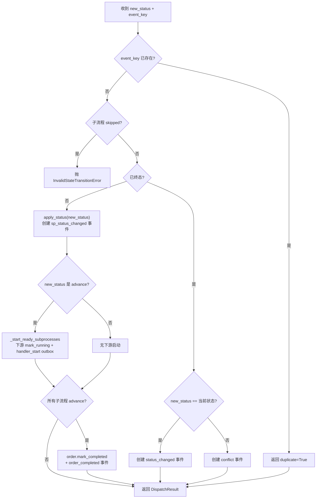
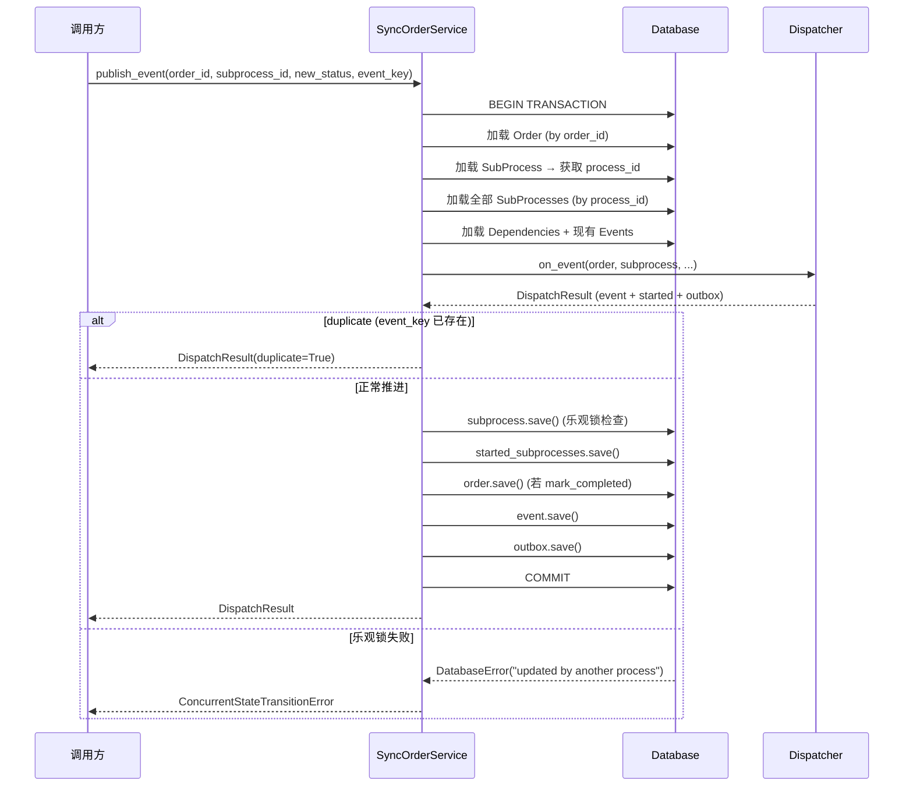
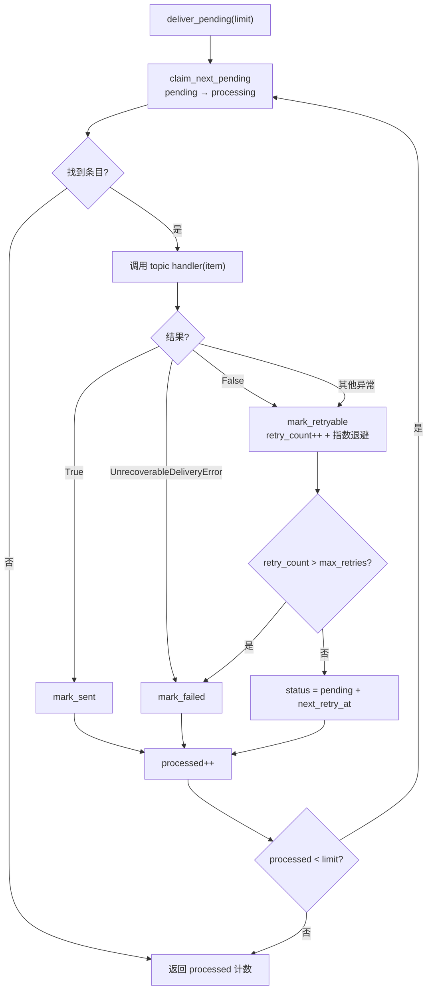
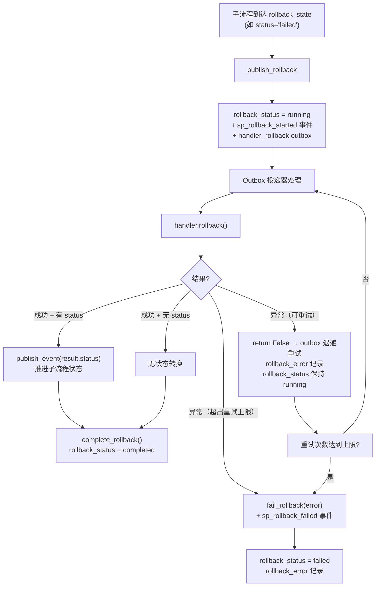

# 运行时

## 调度器 (Dispatcher)

`SyncOrderDispatcher` / `AsyncOrderDispatcher` 是**无状态**的纯逻辑组件：输入内存对象，输出状态变更 + 事件 + outbox 项，不执行任何 I/O。

### 核心方法

#### `on_event`

处理子流程状态转换。流程：



#### `on_timeout`

包装 `on_event`，使用子流程的 `timeout_status` 作为目标状态。

#### `on_rollback`

开始可逆子流程的回滚：

1. **幂等检查**：同 `on_event`
2. **资格检查**：`can_rollback()` 不满足则抛 `InvalidStateTransitionError`
3. `begin_rollback()` → 创建 `sp_rollback_started` 事件 + `handler_rollback` outbox

实际 handler 调用由 outbox 投递器异步执行。

### DispatchResult

```python
class DispatchResult:
    event: OrderEvent              # 产生的事件
    started_subprocesses: list     # 启动的下游子流程
    outbox_items: list             # 待投递的 outbox 条目
    duplicate: bool               # 是否为重复事件
```

### Sync/Async 实现

调度逻辑通过 `_DispatcherBase` 共享，子类仅覆盖 `_event_cls` / `_outbox_cls`：

- `SyncOrderDispatcher` → 产生 `OrderEvent` / `OrderOutbox`
- `AsyncOrderDispatcher` → 产生 `AsyncOrderEvent` / `AsyncOrderOutbox`

`AsyncOrderDispatcher` 的 `async def` 方法存在以保持 API 对等。`on_timeout` 需重写以 `await self.on_event()`（基类的 `self.on_event()` 在异步路径返回协程）。

## 服务层 (Service)

`SyncOrderService` / `AsyncOrderService` 在单事务内完成**加载 → 调度 → 落库**：

### publish_event



**并发处理**：`OrderSubProcess` 的 `OptimisticLockMixin` 在 UPDATE 时检查 `version`。
若版本不匹配（`affected_rows == 0`），`save()` 抛 `DatabaseError`，服务层转为
`ConcurrentStateTransitionError`。

**幂等**：`event_key` 在加载的现有事件中查重，匹配则 `duplicate=True`，不写任何数据。

### publish_timeout

同 `publish_event`，但调用 `dispatcher.on_timeout()`。

### publish_rollback

同结构，但调用 `dispatcher.on_rollback()`，产出 `sp_rollback_started` 事件 + `handler_rollback` outbox。

## Outbox 投递器 (Deliverer)

`SyncOrderOutboxDeliverer` / `AsyncOrderOutboxDeliverer` 独立扫描 pending outbox 条目并投递。

### 投递循环



### Topic 注册

```python
deliverer.register_topic_handler("stateflow:topic:handler_start", topic_callable)
```

Topic handler 是返回 `bool` 的可调用对象（异步路径返回 `Awaitable[bool]`）。

### 恢复机制

`recover_stuck(stuck_after)`：将 `processing` 状态超过 `stuck_after` 时长的条目重置为 `pending`，
用于崩溃恢复。不增加 `retry_count`。

## Handler 注册 (Registry)

### HandlerRegistry

```python
registry = HandlerRegistry(allow_dynamic_import=False)
registry.register("app.handlers.PaymentHandler", PaymentHandler)
```

- 显式注册优先
- `allow_dynamic_import=True` 时，对 `"module.attr"` 格式的 key 尝试 `importlib.import_module`
- `instantiate(key, subprocess)` 返回 `SyncSubProcessHandler` 实例
- `instantiate_async(key, subprocess)` 返回 `AsyncSubProcessHandler` 实例

### 标准 Topic 实现

#### SyncHandlerStartTopic / AsyncHandlerStartTopic

`handler_start` topic 的标准实现：

1. 从 outbox payload 取 `subprocess_id` → 加载子流程 + order_id
2. `registry.instantiate(handler_class, subprocess)` → handler 实例
3. `handler.start()` → `HandlerResult`
4. 若 result 有 status → `service.publish_event()` 推进状态
5. 返回 `True`（投递器标记 sent）

未注册的 handler_class → `UnknownHandlerError` → `UnrecoverableDeliveryError`（不可恢复）

#### SyncHandlerRollbackTopic / AsyncHandlerRollbackTopic

`handler_rollback` topic 的标准实现：

1. 加载子流程 + handler
2. `handler.rollback()` → `HandlerResult`
3. 若 result 有 status → `service.publish_event()` 推进状态
4. `subprocess.complete_rollback()` + save
5. 异常 → 可重试：返回 `False`（outbox 退避重试），`rollback_error` 记录错误
6. 异常 → 不可恢复：超过最大重试次数后 `fail_rollback(error)` + 创建 `sp_rollback_failed` 事件

## 回滚生命周期



### 重试策略

- **可重试异常**：`handler.rollback()` 抛出异常时，topic 返回 `False`，outbox 投递器按指数退避重试（`retry_count++` + `next_retry_at`）
- **最大重试次数**：`SyncHandlerRollbackTopic` / `AsyncHandlerRollbackTopic` 的 `max_rollback_retries` 参数（默认 3 次）
- **永久失败**：超出上限后标记 `rollback_status = failed`，记录 `rollback_error`，生成 `sp_rollback_failed` 事件
- **人工介入恢复**：`can_rollback()` 允许 `rollback_status == failed`，因此 `publish_rollback` 可再次调用重试（修复根因后由操作员触发）

### 幂等

重复 `publish_rollback` 同一 `event_key` → `duplicate=True`。

## 超时调度 (Timer)

### timeout_at 计算

`OrderSubProcess.mark_running()` 在设置 `started_at` 的同时计算：
`timeout_at = started_at + timedelta(seconds=timeout_seconds)`（仅当 `timeout_seconds` 不为 None）。

### 扫描器

`SyncTimeoutScheduler` / `AsyncTimeoutScheduler`：

```python
scheduler = SyncTimeoutScheduler(service, retry_base_delay=60.0, retry_max_delay=3600.0)
processed = scheduler.tick()  # 扫描到期子流程 → service.publish_timeout
```

- 查询：`skipped == False AND timeout_at <= now`
- 每个子流程独立事务处理，单个失败不影响其他

### 幂等与重试

每个超时使用确定性 `event_key`（`timeout:{subprocess_id}`），使 `publish_timeout` 幂等：

- **成功**：子流程转入 `timeout_status`。之后再次被扫描到时返回 `duplicate=True`，调度器跳过
- **失败**：调度器把 `timeout_at` 重置到未来（指数退避：`base * 2^attempt`，上限 `retry_max_delay`），下一轮扫描重试，避免热循环
- **重试次数**：记录在 `subprocess.extra["timeout_retry_count"]`，成功后清除
- `limit` 参数控制单次扫描上限
